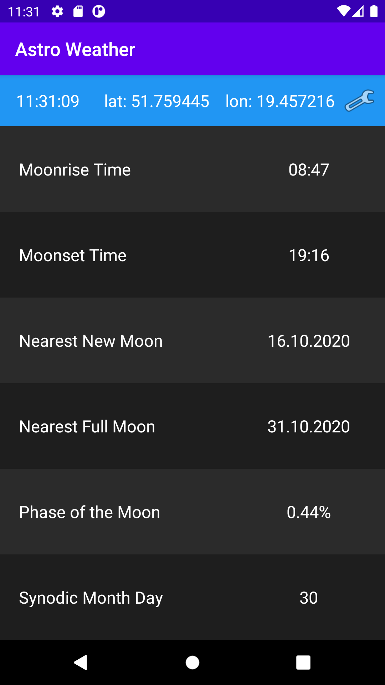

# Astroweather
Application for android, showing weather and sun and moon calculations

# Features
## Sun and Moon
When user first time opens app he can only see sun and moon calculations for default location (which is Łódź).

 

## Preferences
In prefences user can enter coordinates of the place he want to see weather and sun and moon calculations of. In the first screen he can also choose time how frequently information will be refreshed. In the second one He can choose location by writing in city name. All added cities will be stores, so then user can choose his favourite city, for which will curent information show, or delete it. User can also choose if the measurments are shown in metric or imperial system (option isn't shown on the screenshots).

 

## Weather
The weather screen will show location name with temperature, condition, wind and atmosphere information. Below this there is forecast for the next week with condition, and high / low temperatures.

 

# Credits

Images used in project:

https://www.iconfinder.com/iconsets/weather-color-2 by Sihan Liu (weather conditions images)\
https://www.flaticon.com/free-icon/information_906794 by Freepik (unknown/undefined weather image)

